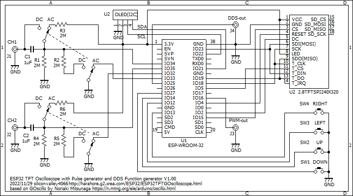

# ESP32TFTOscilloscope
ESP32 Oscilloscope for 320x240 TFT LCD and wireless WEB display

This displays an oscilloscope screen both on a 320x240 TFT LCD and also on the WEB page simultaneusly.
The settings are controled on the touch screen of the TFT LCD and also on the WEB page.
You can view the oscilloscope screen on the WEB browser of the PC or the tablet or the smartphone.

For WEB operations, edit the source code WebTask.ino and replace your Access Point and the password.
<pre>
Edit:
const char* ssid = "XXXX";
const char* pass = "YYYY";
To:
const char* ssid = "Your Access Point";
const char* pass = "Your Password";
</pre>
Develop environment is: 
Arduino IDE 1.8.19 
ESP32 by Espressif Systemsm version 2.0.11 

Libraries: 
TFT_eSPI 2.5.0 
arduinoFFT by Enrique Condes 1.6.1 
arduinoWebSockets from https://github.com/Links2004/arduinoWebSockets 

You need to customize the TFT_espi library by referring to the TFT_espi folder here.

For WEB only display, in case no LCD display is connected, un-comment
<pre>
//#define NOLCD
</pre>
in the file GOscillo.ino.

Schematics: 

